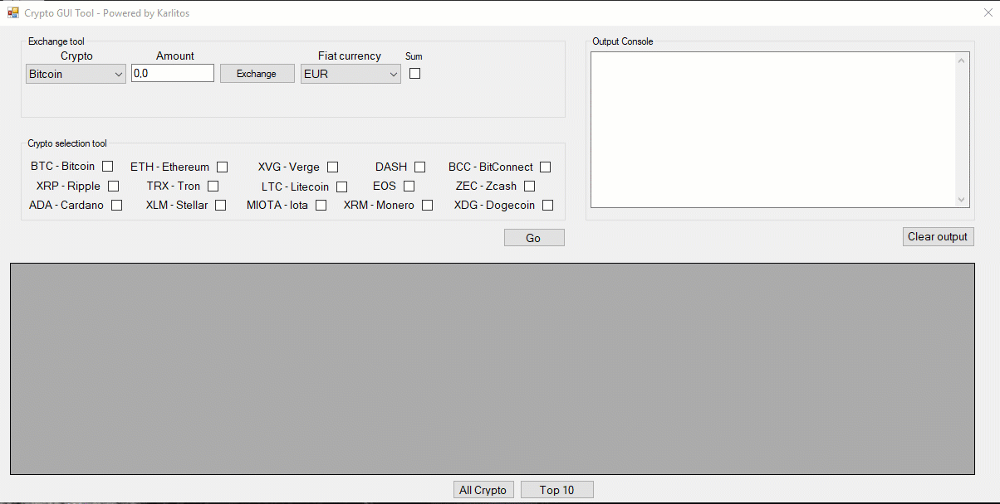

# Crypto GUI App

Crypto GUI App is an application made using C# that allows to:

* know the exchange value of a given amount of chosen cryptocurrency;
* sum the value of different amount of cryptocurrencies;
* check the cryptocurrency market cap rankings, value and etc...;
* visualize the top then cryptocurrencies or the first 100 cryptocurrencies.

All data are retrieved in real-time using the coinmarketcap APIs.

## Project Demo
